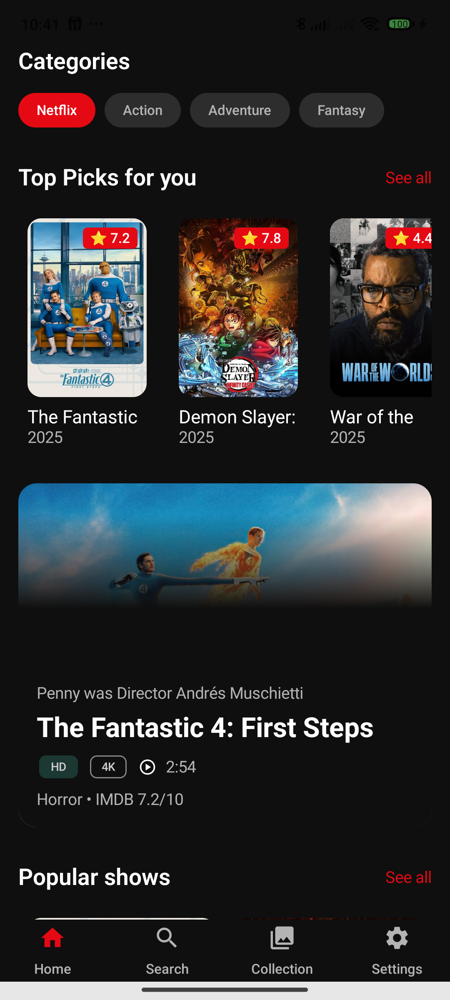
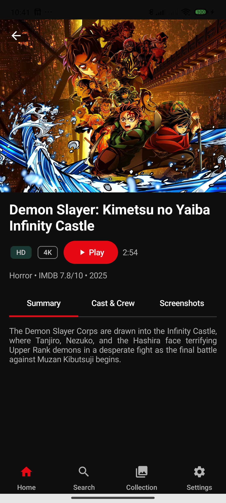

## Cinema Compose Multiplatform

Một ứng dụng cinema đa nền tảng được xây dựng bằng **Compose Multiplatform**, sử dụng The Movie DB (TMDB) API để hiển thị thông tin phim.

## Screenshots

### Android

|  |  | 
|-----------------------------------------------------------------|---------------------------------------------------------------------|

### iOS
Comming soon...

### Desktop
Comming soon...

### Web
Comming soon...

## Tính năng

- Hiển thị danh sách phim phổ biến.

- Xem chi tiết thông tin phim.

- Giao diện người dùng hiện đại, tối ưu cho trải nghiệm xem phim.

- Hỗ trợ đa nền tảng: Android, iOS, Desktop, Web.

## Công nghệ sử dụng

- **Kotlin Multiplatform (KMP):** Chia sẻ Business Logic code giữa các nền tảng.

- **Compose Multiplatform:** Chia sẻ Compose code (UI) giữa các nền tảng.

- **The Movie DB (TMDB) API:** Nguồn dữ liệu phim.

- **Ktor:** HTTP client cho networking.

- **Koin:** Dependency injection.

- **Kotlinx Serialization:** Xử lý JSON.
